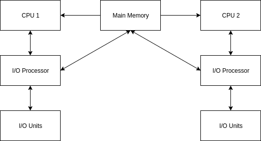

# Types of Operating Systems

Operating Systems are classified under multiple categories depending on their scheduling and execution techniques. Some more common types of Operating Systems are as follows:

* Batch OS
* Multiprogramming OS
* Multiprocessing OS
* Time sharing OS
* Network OS
* Distributed OS
* Real-time OS
* Network OS

## Batch OS

Batch processing is a technique in which an OS collects the programs and data together in a batch before processing starts. An OS does the following activities related to batch processing:

* The OS defines the job which has predefined sequence of commands, programs and data as a single unit.
* The OS keeps a number of jobs in the memory and executes them without manual intervention.
* Jobs are processed in the order of summation such that the first-come-first-serve paradigm is respected.
* When a job completes its execution, its memory is released and the output for the job is copied into an output spool for later printing or processing.

`// Insert diagram here`

The OS is termed as batch processing because the input data or jobs are collected into batches and set of records with similar needs and each batch is processed as a unit. The output is another batch that can be reused for computation.

* In this OS, the user does not interact directly with the computer system.
* The user prepared a job (input data) using offline devices like punch cards and submitted it to the operator.
* After some time the output appeared, consisting of the result of the program as well as a dump of the final memory and register contents for debugging.
* To speed up the processing, operators batched together jobs with similar needs and ran them through the computer as a group.
* In this execution environment, the CPU is often idle because the speed of mechanical input/output devices are much slower than the electronic devices.
* Operating system's major task was to transfer content automatically from one job to the next.
* The operating system was always resident in the memory.

### Advantages of Batch OS

* Batch processing is particularly useful for the operations that require the computer or a peripheral device for an extended period of time and requires very little user interaction.
* Batch processing takes much of the work of the operator to the computer.
* Increased performance as a new job gets started as soon as the previous job is finished, without manual intervention.

### Disadvantages of Batch OS

* Job setup was a real problem. It took a lot of time for mounting of tapes or cards.
* No interaction is possible with user while the program is being executed.
* A job could enter into an infinite loop.
* Due to lack of protection scheme, one batch job can affect the pending jobs.
* CPU remains idle during transition from one job to another.

In order to reduce the wastage of time during job transition, automatic job sequencing was developed. The first operating system, known as Resident Monitor, came into existence. Initially, Resident Monitor was invoked and then it would transfer the control to the program. When the program terminated, it would return the control to the Resident Monitor. Then control goes to the next program, then back again and so on and so forth. The Resident Monitor would automatically sequence the execution of jobs one after another.

Resident Monitor has many identifiable parts, the major one of which was the control card interpreter that was responsible for reading and carrying out instructions on the cards at the point of execution.

## Multiprogramming OS

The need of a system that could keep the CPU always busy with either I/O work or execution of other instructions was felt deeply. The implementation of this came to be known as multiprogramming OS.

* The OS could support keeping multiple jobs in memory at the same time
* The OS could pick and start one job from memory. Whenever the job doesn't need CPU, i.e. during I/O device communication, the OS switches to another job in the memory pool and executes it until it requests I/O, or the previous operation finishes I/O and demands CPU time again.
* The OS in this case is very complex.
* A very high level of memory management is expected from such an OS.
* Switching between jobs is a complex operation as it requires the OS to keep track of how much work was done on each job before it was replaced by another and then resume directly from there.

### Advantages of Multiprogramming OS

* High CPU utilization
* Creates the illusion that many programs are allotted execution time simultaneously

### Disadvantages of Multiprogramming OS

* CPU scheduling is required
* To accommodate many jobs in memory, efficient memory management is required

## Multiprocessing OS

If a system's workload cannot be handled satisfactorily by a single processor, one option is to throw multiple processors at the problem and create a multi-processor environment. This is called a Multiprocessing OS and is a fairly common setup.

Multiprocessing OS refers to the use of two or more CPUs within a single computer system. These multiple CPUs are in a close communication sharing the computer bus, memory & other peripheral devices. These systems are referred to as *tightly couple systems*.

These types of systems are used when very high speed is required to process a large volume of data. These systems are generally used in environment like satellite control, weather forecasting etc. The basic organization of multiprocessing system is as follows.

## Time sharing OS

## Real-time OS

A real time operating system is one in which the correctness of computation not only depends on the correctness of the logical computation but also upon the time at which the result is produced.

If the timing constraint of the system are not met, then system failure is said to have occurred.

It is defined as an OS known to give maximum time for each of the critical operations that occur, like syscalls and interrupt handling.

It is essential that the timing constraints of the system are guaranteed to be met. Guaranteeing timing (deadline) behavior requires that the system should be predictable. It is also desirable that the system should attain a high degree of utilization while satisfying the timing constraints of the system.
